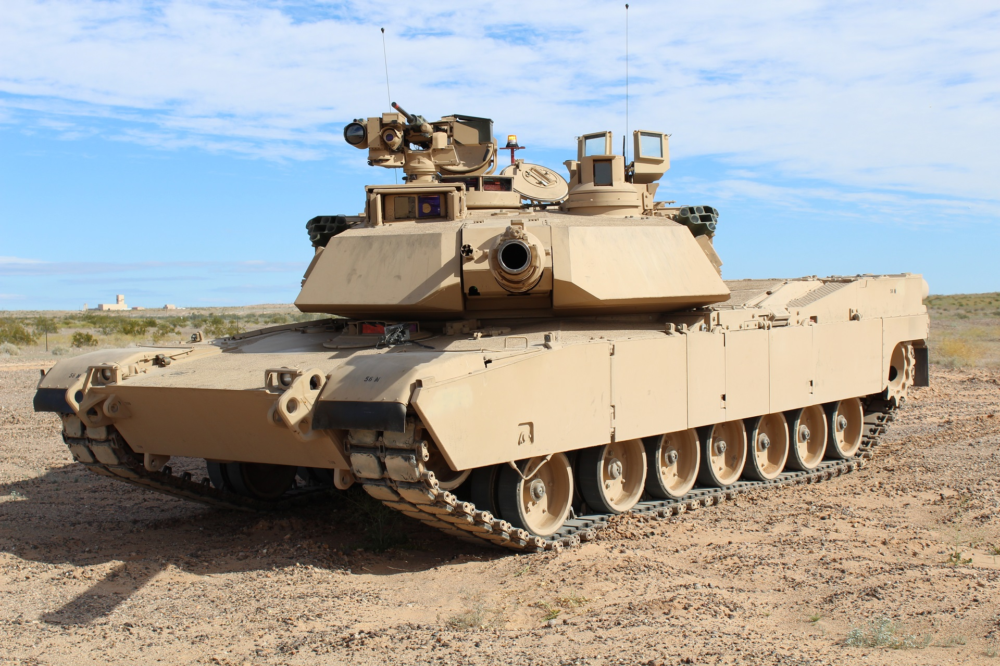
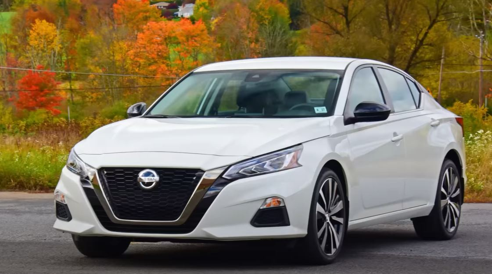
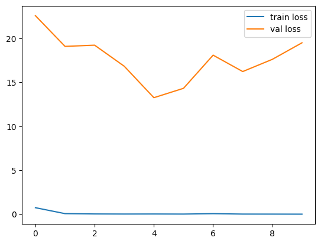
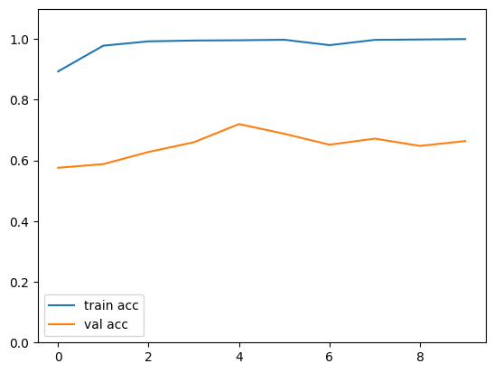

# Forklift Certified

## The project is a Deep Learning model that predicts wether an image is a forklif, a tank or other vehicle.

The model is built using the transfer learning concept, based on VGG-16 (weighted with imagenet) without the head, it is then trained, validated and tested with pictures of forklifts (about 1,000), tanks (about 1,300) and different types of cars (about 1,500) all of them, with data augmentation.

The transfer learning method is used because creating image classification models can be really challenging for a normal server and takes a lot of data and training time to get to a good model, as well as it is important to use the tools we now have to create better results with less effort. The VGG-16 model was chosen firstly, because it is the model learnt in classes so it is familiar and also because it is a "simple" model made for classifications like this. For further iterations of the model, other pre-trained models like VGG-19 could be used to test for better performance. All this implementing the machine learning library 'TensorFlow' and it's modules 'keras'.

The forklift, tank and car images were taken from [www.images.cv](https://www.images.cv), this source was chosen because it is the only one found with enough pictures of forklifts and opt for model training. The source also gives freedom of size of the images, serveral different augmentation techniques and download format.

The model reached a max training accuracy of 100%, while giving us a max validation accuracy of 72% (as shown in the graphs below), meaning that the model is overfitted and the model needs modifications for a better performance and we can validate that wiht the test accuracy, which got a 69% accuracy. The improvement of the model is set for another further time, but the actions that could be taken are developing a simpler model, as shown in the summary of the model, it has 10,617,859 trainable parameters, on top of the already trained 25,332,547 parameters of the VGG16 transfered model so, if we reduce the amount of trainable params, the overfitting may reduce and come up with a better model.

The next is the model summary which can be found, along with the whole code of the solution in [this jupyter notebook](https://github.com/A00572858/forklift/blob/main/forkliftCertified.ipynb) within this repository.

