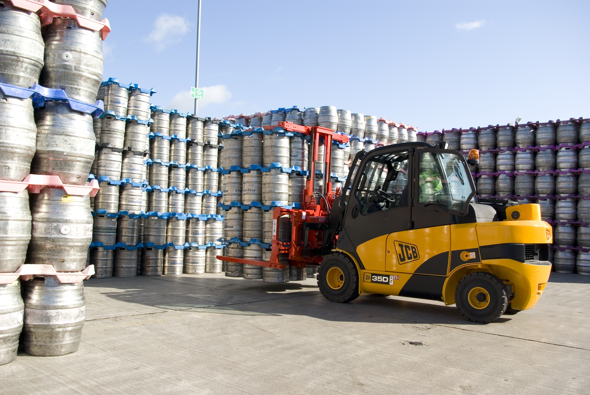

# Forklift Certified

## The project is a Deep Learning model that predicts wether an image is a forklif or not.

The model is built using the transfer learning concept, based on VGG-16 (weighted with imagenet) without the head, it is then trained, validated and tested with pictures of forklifts (about 1,000) and extending the training data using data augmentation, as well as with pictures of different cars (about 1,500) also, with data augmentation.

The transfer learning method is used because creating image classification models can be really challenging for a normal server and takes a lot of data and training time to get to a good model, as well as it is important to use the tools we now have to create better results with less effort. The VGG-16 model was chosen firstly, because it is the model learnt in classes so it is familiar and also because it is a "simple" model made for classifications like this. For further iterations of the model, other pre-trained models like VGG-19 could be used to test for better performance.

The forklift and car images were taken from [www.images.cv](www.images.cv), this source was chosen because it is the only one found with enough pictures of forklifts and opt for model training. The source also gives freedom of size of the images, serveral different augmentation techniques and download format.

